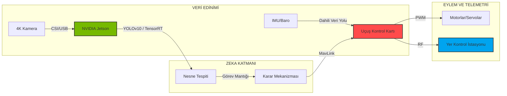

# 🛸 UAV-ARCHITECT-GLOBAL: ELITE COMMAND CENTER
### *Uluslararası İHA ve Otonom Sistemler Stratejik Mimarisi*

<div align="center">


---

"Göklerin otonom geleceği, mükemmel bir mimari ile başlar."

[2026 Görev Şartnamesi](docs/2026_SPEC_REQUIREMENTS.md) • [Sistem Mimarisi](docs/ARCH_OVERVIEW.md) • [Rakip Analizi](docs/competitor_analysis.md)

</div>

---

**UAV-Architect-Global**, sadece bir yazılım koleksiyonu değil; 2026 TEKNOFEST standartlarında karmaşık görevleri yöneten **Yüksek Performanslı bir Stratejik Mimari Rehberidir**.

### ⚡ 2026 Mission Dashboard
| Özellik | Detay |
| :--- | :--- |
| **Hedef Tespiti** | YOLOv10 + OpenCV Geometrik Analiz |
| **Yük Mekanizması** | Dual-Color Hassas Bırakma Sistemi |
| **Teknik Kısıt** | Max 4kg / 8 Dakika Kurulum Süresi |
| **Mimari** | Observer-Executor (Jetson + Pixhawk) |

## 🇺🇸 GENEL BAKIŞ

**UAV-Architect-Global**, uçtan uca karmaşık İHA görevlerini yönetmek için tasarlanmış yüksek performanslı bir **Sistem Mimari Rehberidir**. İHA'yı bir "Uçan Sunucu" (Flying Server) olarak ele alır; gelişmiş yapay zeka çıkarımlarını güvenilir uçuş kontrol protokolleriyle entegre eder.

### 🏗️ Ana Mimari
Depo, maksimum modülerlik için "Elit Çekirdek" yapısında kurgulanmıştır:
- **`src/main_brain/`**: Yapay zeka görev mantığı ve karar alma.
- **`src/telemetry/`**: Yer Kontrol İstasyonu (GCS) ve MavLink haberleşme köprüsü.
- **`src/avionics/`**: Donanım soyutlama ve acil durum protokolleri.

---

## 📊 SİSTEM ENTEGRASYON AKIŞI



---

## 🛠️ DEPO YAPISI (PROJE MİMARİSİ)

```text
├── .github/                # Issue ve PR şablonları
├── assets/                 # Yüksek çözünürlüklü görseller
├── docs/                   # Teknik dokümanlar
│   ├── 2026_SPEC_REQUIREMENTS.md # 2026 Kuralları ve Hedefleri
│   ├── ARCH_OVERVIEW.md    # Sistem Mimari Detayları
├── src/                    # "Elit Çekirdek" kaynak kodlar
│   ├── main_brain/        # Yapay Zeka ve Görev Mantığı
│   ├── telemetry/         # Haberleşme Merkezi
│   └── avionics/          # Donanım Kontrol
├── CONTRIBUTING.md         # Katkı sağlama rehberi
├── LICENSE                 # MIT Lisansı
└── README.md               # Komuta Merkezi
```

---

## 🚀 BAŞLARKEN (HIZLI BAŞLANGIÇ)

1. **Mimariyi Klonlayın:**
   ```bash
   git clone https://github.com/bahattinyunus/teknofest_uluslararasi_iha.git
   ```
2. **Beyin Modülünü İnceleyin:**
   [src/main_brain/core.py](file:///g:/Di%C4%9Fer%20bilgisayarlar/Diz%C3%BCst%C3%BC%20Bilgisayar%C4%B1m/github%20repolar%C4%B1m/teknofest_uluslararasi_iha/src/main_brain/core.py) içerisindeki görev mantığı şablonunu kontrol edin.
3. **Mimarisi Analiz Edin:**
   [Sistem Derin Dalış](file:///g:/Di%C4%9Fer%20bilgisayarlar/Diz%C3%BCst%C3%BC%20Bilgisayar%C4%B1m/github%20repolar%C4%B1m/teknofest_uluslararasi_iha/docs/ARCH_OVERVIEW.md) dökümanını okuyun.

---

## 👨‍💻 GELİŞTİRİCİ PROFİLİ

### **Bahattin Yunus Çetin**
*BT Mimarı Adayı | Havacılık Vizyoneri*

*   🌍 **Konum:** Trabzon, Türkiye
*   🔗 **LinkedIn:** [linkedin.com/in/bahattinyunus](https://www.linkedin.com/in/bahattinyunus/)
*   💻 **GitHub:** [github.com/bahattinyunus](https://github.com/bahattinyunus)

---

<div align="center">

*“Otonom uçuş, özgürlüğün kodlanmış halidir.”*

**© 2026 Bahattin Yunus Çetin. Of, Trabzon.**


</div>
<p align="center">
  
</p>
