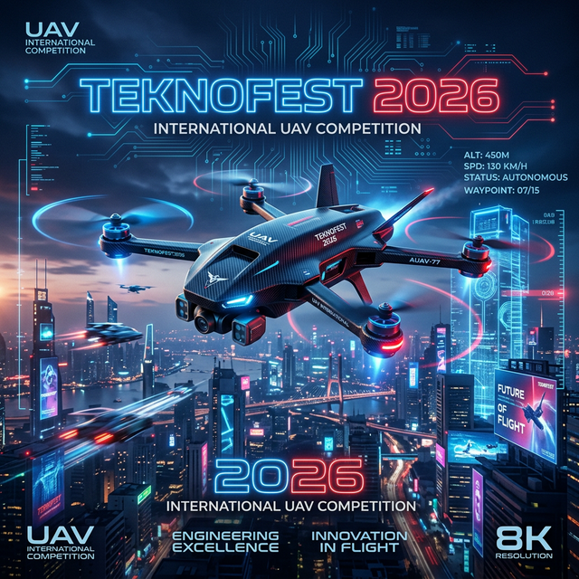
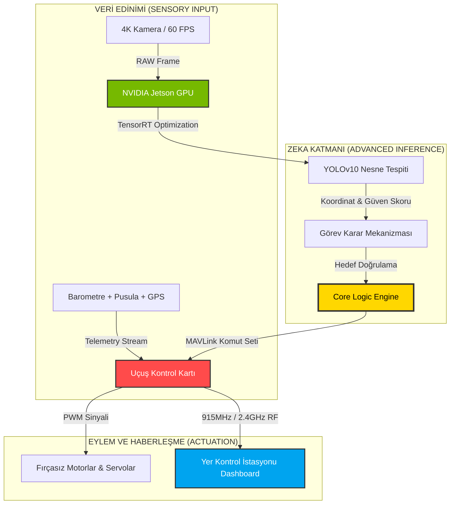



# 🛸 UAV-ARCHITECT-GLOBAL: ELİT KOMUTA MERKEZİ
### *Uluslararası İHA ve Otonom Sistemler Stratejik Mimarisi*

<div align="center">


---

"Göklerin otonom geleceği, mükemmel bir mimari ile başlar."

[2026 Görev Şartnamesi](docs/2026_SPEC_REQUIREMENTS.md) • [Sistem Mimarisi](docs/ARCH_OVERVIEW.md) • [Rakip Analizi](docs/competitor_analysis.md)

</div>

---

**UAV-Architect-Global**, sıradan bir yazılım deposundan çok daha fazlasını vaat eder; o, 2026 TEKNOFEST Uluslararası İHA Yarışması'nın en zorlu senaryoları için tepeden tırnağa optimize edilmiş **Yüksek Performanslı ve Stratejik bir Mimari Ekosistemdir**. Bu platform, modern otonom sistemlerde karşılaşılan karmaşık mühendislik problemlerine uçtan uca çözümler sunan, her satırı titizlikle planlanmış bir "Sistem Tasarım Rehberi" olarak kurgulanmıştır. Amacımız, İHA'yı sadece uçan bir araç olarak değil, gökyüzünde karar verebilen, analiz yapabilen ve en zorlu şartnamelere bile kusursuzca uyum sağlayan bir "Dinamik Zeka Platformu" olarak yeniden tanımlamaktır.

### ⚡ 2026 Mission Dashboard (Görev Paneli)
| Özellik | Teknik Detay | Operasyonel Karşılık |
| :--- | :--- | :--- |
| **Hedef Tespiti** | YOLOv10 + OpenCV Geometrik Analiz | Altıgen ve Üçgen hedeflerin %98+ doğrulukla tespiti. |
| **Yük Mekanizması** | Dual-Color Hassas Bırakma Sistemi | Kırmızı/Mavi yüklerin senkronize ve doğru hedefe bırakılması. |
| **Teknik Kısıt** | Max 4kg / 8 Dakika Kurulum Süresi | Hızlı montaj ve hafif yapı optimizasyonu. |
| **Ana Mimari** | Observer-Executor (Jetson + Pixhawk) | Yapay zeka ile uçuş kontrolünün kusursuz entegrasyonu. |

---

## 🎯 GÖREV STRATEJİSİ VE OPERASYONEL ANALİZ (MISSION STRATEGY)

2026 şartnamesindeki dual-payload (çift yük) zorunluluğu ve altıgen/üçgen gibi farklı geometrik formdaki hedeflerin otonom tespiti, sistemimizde üç katmanlı ve yüksek hassasiyetli bir stratejiyle yönetilir. Bu strateji, sadece bir uçuş rotası değil, aynı zamanda anlık veri analitiği ve risk yönetimini de kapsar:

1.  **Geniş Alan Taraması ve Durumsal Farkındalık (Wide-Scan):** İHA, kalkışın ardından belirlenen operasyonel irtifada (AGL 30-50m aralığında optimize edilmiş) GPS tabanlı otonom bir "grid" tarama rotasına başlar. Bu aşamada, yer istasyonu ile kesintisiz veri akışı sağlanarak alanın sayısal ikizi üzerinden hedeflerin kaba konumları işaretlenir. Yazılımımız, her kareden gelen veriyi süzerek potansiyel hedef adaylarını (Target Candidates) bir havuza toplar ve en yüksek güven skoruna sahip olanı otonom olarak önceliklendirir.
2.  **Yapay Zeka Destekli Hassas Kilitlenme (Precision Lock):** Görüntü işleme ünitemiz (YOLOv10), eğitimli modelini kullanarak hedefi milisaniyeler bazında tespit ettiğinde, kontrol sistemi "Visual Servoing" (Görsel Denetimli Kontrol) moduna geçiş yapar. Bu modda, İHA sadece koordinata değil, optik akış verisine odaklanarak hedefi dikey eksende kusursuz bir şekilde merkezleyene kadar motor hızlarını milimetrik olarak ayarlar. Bu süreçte, drone'un rüzgar etkisiyle oluşabilecek yalpalamaları (drift), yapay zeka tarafından anlık olarak kompanse edilir.
3.  **Dinamik Balistik Bırakma ve İniş (Dynamic Drop):** Hedef merkezlendiğinde, `core.py` içerisinde yer alan gelişmiş fizik şablonu; anlık yer hızı (Ground Speed), rüzgar vektörü ve irtifayı hesaplayarak ideal bırakma noktasını belirler. Servo mekanizması bu kritik eşleşmeyle tetiklenir ve ardından İHA, görevin tamamlandığını teyit ederek otonom olarak kalkış noktasına veya belirlenen iniş alanına (RTL/Landing) yönelir. Bırakma sonrası sistem, yükün hedefe olan mesafesini son kez kamerayla doğrular ve görevi başarıyla kapatır.

---

## 💻 GELİŞMİŞ TEKNOLOJİ YIĞINI VE ALTYAPI

Sistemimiz, donanım ve yazılımın senkronize bir şekilde çalışmasını sağlayan hibrit bir yapı üzerine kurulmuştur. Her bir bileşen, maksimum verimlilik ve minimum gecikme süresi hedeflenerek seçilmiştir:

| Katman | Teknoloji | Teknik Avantaj |
| :--- | :--- | :--- |
| **Donanım Çözümleri** | NVIDIA Jetson Orin Nano | 20 TOPS yapay zeka performansı ile "Edge Computing" (Kenar Hesaplama) gücü sayesinde bulut ihtiyacı duymadan anlık yerel işleme. |
| **Uçuş Kontrol Sistemi** | Pixhawk 6C + ArduPilot | EKF3 filtreleme, yüksek hassasiyetli pusula ve gelişmiş navigasyon algoritmalarıyla sarsıntısız ve güvenilir uçuş kontrolü. |
| **Yapay Zeka / Tespit** | YOLOv10 + TensorRT | FP16 hassasiyetinde optimize edilmiş Quantized modellerle anlık hedef teşhisi, sınıflandırma ve 60+ FPS ile akıcı analiz. |
| **Haberleşme Katmanı** | MAVLink + Micro-ROS | Bant genişliğinde %40 tasarruf sağlayan sıkıştırılmış ikili veri paketleri ve görev kritik veriler için milisaniye seviyesinde iletim. |
| **Simülasyon Ortamı** | Gazebo / AirSim | Fotorealistik fizik motoru sayesinde donanım kısıtları ve fiziksel dünyadaki riskler olmadan binlerce farklı senaryoda görev provası. |

---

## �� GENEL BAKIŞ VE MİMARİ FELSEFE

**UAV-Architect-Global**, uçtan uca tüm karmaşık İHA operasyonlarını akıllı bir şekilde yönetmek üzere sıfırdan tasarlanmış profesyonel bir **Sistem Mimari Rehberidir**. Biz, İHA'yı sadece piller ve motorlardan oluşan bir donanım olarak değil, gökyüzünde görev yapan yüksek kapasiteli bir "Uçan Sunucu" (Flying Server) olarak ele alıyoruz. Bu felsefe doğrultusunda, Jetson gibi güçlü işlemcilerin sunduğu yapay zeka çıkarım kapasitesini, Pixhawk gibi güvenilir uçuş kontrol protokolleriyle en verimli şekilde entegre ederek, otonom sistemlerde yeni bir standart belirliyoruz.

### 🏗️ Ana Mimari Yapı (Core Logic)
Depo, sistem bileşenlerinin birbirini engellemeden çalışabilmesi ve geliştirme süreçlerinin hızlandırılması için "Elit Çekirdek" (Elite Core) modüler yapısında kurgulanmıştır. Bu sayede hata ayıklama süreçleri lokalize edilerek sistem dayanıklılığı (resilience) artırılmıştır:
- **`src/main_brain/`**: Sistemin "Karar Mekanizması". Yapay zeka görev mantığı, hedef doğrulama algoritmaları ve stratejik kararların alındığı ana merkez.
- **`src/telemetry/`**: Sistemin "Ses Telleri". Yer Kontrol İstasyonu (GCS) ile kurulan yüksek hızlı ve güvenli MavLink haberleşme köprüsü.
- **`src/avionics/`**: Sistemin "Refleksleri". Donanım soyutlama katmanı, sensör füzyonu ve acil durum (failsafe) protokollerinin yönetildiği taban.

---

## 📊 SİSTEM ENTEGRASYON AKIŞI: VERİDEN EYLEME

Aşağıdaki şema, sistemin bir görüntüyü alıp onu nasıl fiziksel bir "yük bırakma" eylemine dönüştürdüğünü, her bir katmanın sorumluluğunu detaylandırarak göstermektedir:



---

## 🛠️ DEPO YAPISI (PROJE MİMARİSİ)

```text
├── .github/                # Issue ve PR şablonları
├── assets/                 # Yüksek çözünürlüklü görseller ve Banner
├── docs/                   # Teknik dokümanlar
│   ├── 2026_SPEC_REQUIREMENTS.md # 2026 Kuralları ve Detaylı Hedefler
│   ├── ARCH_OVERVIEW.md    # Mimari Felsefe ve Derin Dalış
├── src/                    # "Elit Çekirdek" (Elite Core) Kaynak Kodlar
│   ├── main_brain/        # Yapay Zeka, YOLO ve Görev Mantığı
│   ├── telemetry/         # Yer Kontrol İstasyonu Haberleşme Merkezi
│   └── avionics/          # PID Kontrol ve Donanım Sürücüleri
├── CONTRIBUTING.md         # Katkı sağlama rehberi ve adımları
├── LICENSE                 # MIT Lisansı (Açık Kaynak Kullanım)
└── README.md               # Projenin Ana Komuta Merkezi
```

---

## 🚀 BAŞLARKEN (HIZLI BAŞLANGIÇ)

### 1. Mimariyi Lokal Sisteminize Klonlayın
```bash
git clone https://github.com/bahattinyunus/teknofest_uluslararasi_iha.git
cd teknofest_uluslararasi_iha
```

### 2. Gerekli Bağımlılıkları Kurun
Sistemin tam kapasite çalışması için OpenCV, NumPy ve MAVProxy kütüphaneleri gereklidir. Jetson üzerinde TensorRT kurulumu tavsiye edilir:
```bash
pip install opencv-python numpy pymavlink
```

### 3. Simülasyon Testini (SITL) Başlatın
Sahaya çıkmadan önce, yazılımsal simülasyon (Software In The Loop) modunda görev mantığını test etmek için:
```bash
python -m src.main_brain.core --mode simulation
```

---

## 🛠️ GELİŞTİRİCİ DENEYİMİ (DX) & PROFESYONEL HATA AYIKLAMA

Bu proje, sadece bir "kod deposu" değil, geliştiriciler için uçuş sabahı yaşanabilecek aksaklıkları minimize eden devasa bir araç setidir. Sistem, operasyonların her aşamasında şeffaflık ve izlenebilirlik sunar:

-   **Derinlikli Loglama Sistemi:** `logs/` dizini, sadece metin bazlı verileri değil; aynı zamanda anlık işlemci yükü, termal durumlar ve MavLink paketlerinin milisaniye seviyesindeki gecikme sürelerini de kayıt altına alarak "Post-Flight" analizi yapmanıza olanak tanır.
-   **Görsel Analiz ve Kamera Testi:** `scripts/camera_check.py` aracı sayesinde, sahaya çıkmadan önce kameranın netlik ayarları, renk eşikleme (HSV) hassasiyeti ve YOLO modelinin FPS performansı statik bir ortamda güvenle test edilebilir.
-   **GCS Görselleştirici:** `telemetry/visualizer.py` ile İHA'nın havada gördüğü dünyayı ve takip ettiği otonom rotayı 3 boyutlu bir arayüz üzerinden anlık olarak izleyebilir, manuel müdahale gerektiren durumları saniyeler içinde önceden tespit edebilirsiniz.

---

## 👨‍💻 GELİŞTİRİCİ PROFİLİ VE VİZYON

### **Bahattin Yunus Çetin**
*BT Mimarı Adayı | Havacılık ve Uzay Sistemleri Vizyoneri*

*   🌍 **Konum:** Trabzon, Türkiye
*   🔗 **LinkedIn:** [linkedin.com/in/bahattinyunus](https://www.linkedin.com/in/bahattinyunus/)
*   💻 **GitHub:** [github.com/bahattinyunus](https://github.com/bahattinyunus)
*   📧 **İletişim:** [bahattinyunuscetin@gmail.com](mailto:bahattinyunuscetin@gmail.com)

---

<div align="center">

*“Otonom uçuş, özgürlüğün dijital olarak kodlanmış halidir. Biz sadece o kodu mükemmelleştiriyoruz.”*

**© 2026 Bahattin Yunus Çetin. Of, Trabzon.**

</div>

<p align="center">
  
</p>
