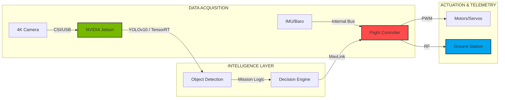

# 🛸 UAV-ARCHITECT-GLOBAL: ELITE COMMAND CENTER
### *Uluslararası İHA ve Otonom Sistemler Stratejik Mimarisi*

<div align="center">


---

"Göklerin otonom geleceği, mükemmel bir mimari ile başlar." / "The autonomous future of the skies starts with elite architecture."

[2026 Mission Spec](docs/2026_SPEC_REQUIREMENTS.md) • [System Architecture](docs/ARCH_OVERVIEW.md) • [Competitor Analysis](docs/competitor_analysis.md)

</div>

---

**UAV-Architect-Global**, sadece bir yazılım koleksiyonu değil; 2026 TEKNOFEST standartlarında karmaşık görevleri yöneten **Yüksek Performanslı bir Stratejik Mimari Rehberidir**.

### ⚡ 2026 Mission Dashboard
| Özellik | Detay |
| :--- | :--- |
| **Hedef Tespiti** | YOLOv10 + OpenCV Geometrik Analiz |
| **Yük Mekanizması** | Dual-Color Hassas Bırakma Sistemi |
| **Teknik Kısıt** | Max 4kg / 8 Dakika Kurulum Süresi |
| **Mimari** | Observer-Executor (Jetson + Pixhawk) |

## 🇺🇸 ENGLISH OVERVIEW

**UAV-Architect-Global** is a high-performance **System Architecture Guide** designed to manage complex UAV missions from end-to-end. It treats the UAV as a "Flying Server," integrating advanced AI inference with reliable flight control protocols.

### 🏗️ Master Architecture (EN)
The repository is structured into an "Elite Core" for maximum modularity:
- **`src/main_brain/`**: AI mission logic and decision making.
- **`src/telemetry/`**: GCS and MavLink communication bridge.
- **`src/avionics/`**: Hardware abstraction and emergency protocols.

---

## 📊 SYSTEM INTEGRATION FLOW



---

## 🛠️ REPO STRUCTURE (MASTERPIECE LEVEL)

```text
├── .github/                # Issue & PR templates
├── assets/                 # High-res diagrams & resources
├── docs/                   # Technical whitepapers (ARCH_OVERVIEW.md)
├── src/                    # The "Elite Core"
│   ├── main_brain/        # AI & Mission Logic
│   ├── telemetry/         # Communication Hub
│   └── avionics/          # Hardware Control
├── CONTRIBUTING.md         # Professional guide
├── LICENSE                 # MIT Open Source
└── README.md               # The Command Center
```

---

## 🚀 GETTING STARTED (QUICK START)

1. **Clone the Architect Core:**
   ```bash
   git clone https://github.com/bahattinyunus/teknofest_uluslararasi_iha.git
   ```
2. **Explore the Brain:**
   Check [src/main_brain/core.py](file:///c:/github%20repolar%C4%B1m/teknofest_uluslararasi_iha/src/main_brain/core.py) for the mission logic template.
3. **Analyze the Architecture:**
   Read the [System Deep Dive](file:///c:/github%20repolar%C4%B1m/teknofest_uluslararasi_iha/docs/ARCH_OVERVIEW.md).

---

## 👨‍💻 DEVELOPER PROFILE

### **Bahattin Yunus Çetin**
*IT Architect Candidate | Aerospace Visionary*

*   🌍 **Location:** Trabzon, Turkey
*   🔗 **LinkedIn:** [linkedin.com/in/bahattinyunus](https://www.linkedin.com/in/bahattinyunus/)
*   💻 **GitHub:** [github.com/bahattinyunus](https://github.com/bahattinyunus)

---

<div align="center">

*“Otonom uçuş, özgürlüğün kodlanmış halidir.”*

**© 2026 Bahattin Yunus Çetin. Of, Trabzon.**


</div>
<p align="center">
  
</p>
